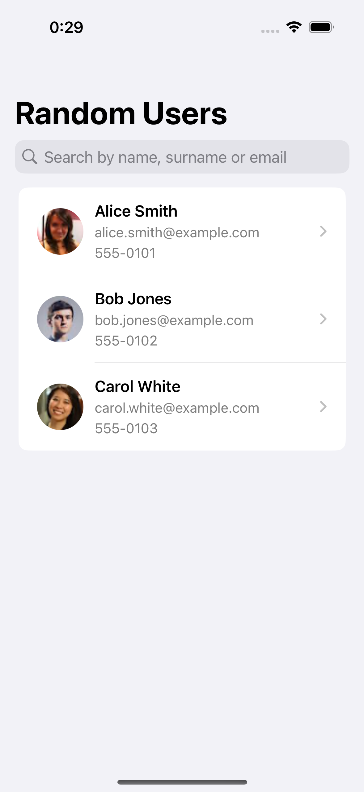
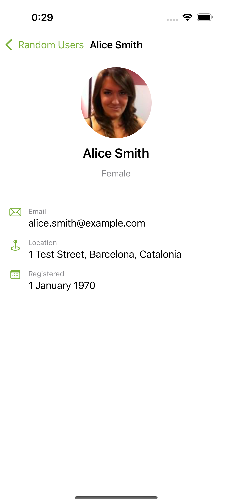
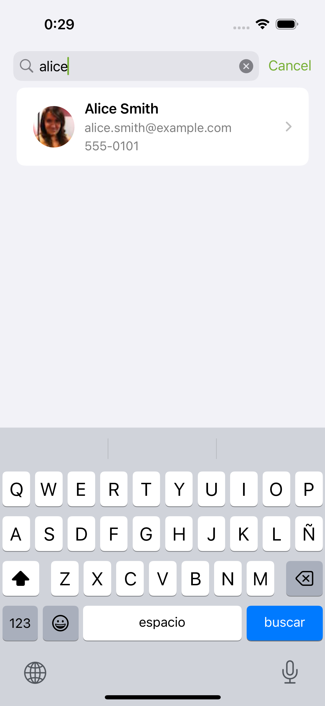
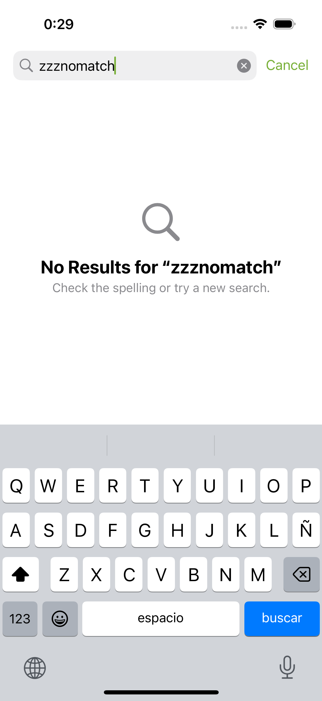
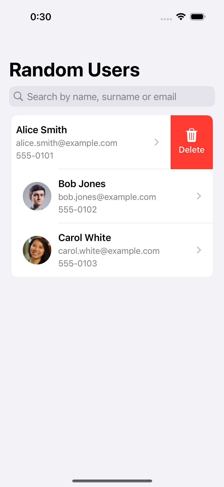
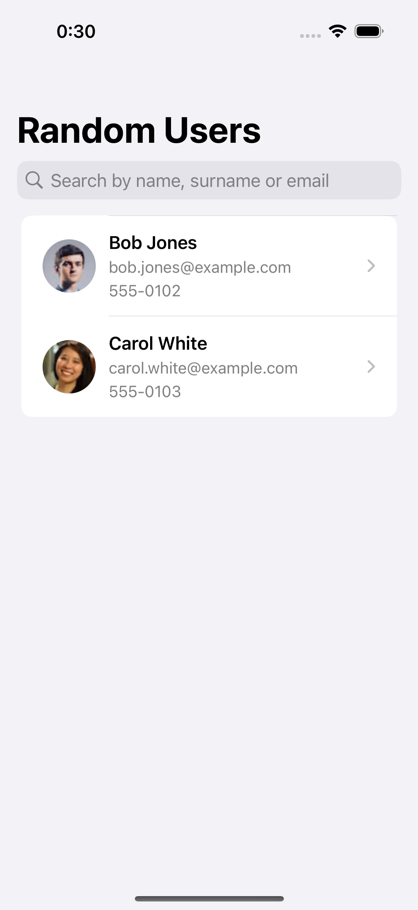

# Random User Coding Challenge

An iOS application that fetches and displays random users from the [RandomUser API](https://randomuser.me). Built as a home challenge for a Senior iOS Engineer position.

## Features

- Browse a paginated list of users with avatar, name, email, and phone
- Infinite scroll — automatically loads more users as you reach the bottom
- Persistent soft delete — deleted users never reappear, even after new fetches
- Debounced real-time search by first name, last name, or email
- Tap any user to view full details: gender, location, and registration date
- Stable list order preserved across app launches

## Screenshots

| User List | Detail View | Search Results | Search Empty | Before Delete | After Delete |
|:---------:|:-----------:|:--------------:|:------------:|:-------------:|:------------:|
|  |  |  |  |  |  |

> Screenshots can be regenerated by running `ScreenshotCapture` in the UI test target.

## Requirements

- iOS 18.5+ deployment target
- No external dependency manager — SwiftLint is integrated via Swift Package Manager plugin (Xcode resolves it automatically)

## Setup

1. Clone the repository
2. Open `RandomUserCodingChallenge/RandomUserCodingChallenge.xcodeproj` in Xcode
3. Select a simulator (iPhone 16 recommended) and run

No additional configuration is needed. The app fetches live data from `https://api.randomuser.me` on first launch.

## Architecture

The app uses **Clean Architecture** with an **MVVM** presentation layer. Dependencies flow strictly inward — the Domain layer has zero framework dependencies.

```
┌─────────────────────────────────────────────┐
│              Presentation Layer             │
│  UserListView · UserListViewModel           │
│  UserDetailView · UserRowView               │
└────────────────────┬────────────────────────┘
                     │ uses
┌────────────────────▼────────────────────────┐
│               Domain Layer                  │
│  User (model)                               │
│  FetchUsersUseCase                          │
│  DeleteUserUseCase                          │
│  FilterUsersUseCase                         │
│  UserRepositoryProtocol                     │
│  RandomUserAPIClientProtocol                │
└────────┬───────────────────────┬────────────┘
         │ implements            │ implements
┌────────▼──────────┐  ┌─────────▼────────────┐
│   Local (Data)    │  │   Remote (Data)       │
│  UserRepository   │  │  RandomUserAPIClient  │
│  UserEntity       │  │  RandomUserAPI (DTOs) │
│  (SwiftData)      │  │  StubAPIClient        │
└───────────────────┘  └──────────────────────┘
```

```
App/
├── AppDependencies.swift          # DI container — constructs all dependencies at startup
└── ContentView.swift              # Root view — receives injected dependencies

Domain/                            # Pure Swift, zero framework dependencies
├── Models/User.swift
├── Repositories/                  # Protocol definitions only
└── UseCases/                      # FetchUsersUseCase, DeleteUserUseCase, FilterUsersUseCase

Data/
├── UserDefaultsManager.swift      # Generic UserDefaults read/write wrapper
├── Remote/                        # URLSession API client, Decodable DTOs, NetworkError, PaginationStore
├── Local/                         # SwiftData @Model (UserEntity), UserRepository
└── Stub/StubAPIClient.swift       # Fixed fixture data — injected during UI testing

Presentation/
├── UserList/                      # UserListView + UserListViewModel (@Observable)
└── UserDetail/                    # UserDetailView (display-only, no ViewModel)
```

See [`docs/architecture.md`](docs/architecture.md) for sequence diagrams and a full layer breakdown.

## Tech Stack

| Concern | Solution |
|---|---|
| UI | SwiftUI |
| Persistence | SwiftData |
| Networking | URLSession + `async/await` |
| State management | `@Observable` (iOS 17 Observation framework) |
| Unit testing | XCTest + protocol-based mocks |
| UI testing | XCTest + Page Object Model |
| Linting | SwiftLint (SPM plugin) |
| Formatting | SwiftFormat (Xcode build phase) |

No third-party libraries. No CocoaPods or Carthage.

## Testing

The project has two test targets:

**Unit tests** (`RandomUserCodingChallengeTests`) — 31 tests across 4 test classes, all using protocol-based mocks and a `User.fixture()` factory. No SwiftData or URLSession in unit tests.

**UI tests** (`RandomUserCodingChallengeUITests`) — 16 tests using the Page Object Model. The test host always injects `StubAPIClient` (3 fixed users) via the `--ui-testing` launch argument, giving deterministic, network-free UI tests.

```bash
# Run all tests
xcodebuild test -scheme RandomUserCodingChallenge \
  -destination 'platform=iOS Simulator,name=iPhone 16'

# Unit tests only
xcodebuild test -scheme RandomUserCodingChallenge \
  -destination 'platform=iOS Simulator,name=iPhone 16' \
  -only-testing:RandomUserCodingChallengeTests

# UI tests only
xcodebuild test -scheme RandomUserCodingChallenge \
  -destination 'platform=iOS Simulator,name=iPhone 16' \
  -only-testing:RandomUserCodingChallengeUITests
```

See [`docs/testing-strategy.md`](docs/testing-strategy.md) for a full breakdown of coverage and approach.

## Key Decisions

**Soft delete over hard delete**
Deleted users are flagged with `isDeleted = true` in SwiftData rather than being removed from the database. This ensures the deletion intent survives new API fetches — newly fetched users are checked against deleted IDs before being saved.

**Deduplication by `login.uuid`**
The RandomUser API can return the same user across pages. Every incoming user is checked against the local store by `login.uuid`, and existing records are not re-inserted, preserving the original `insertedAt` ordering.

**Stable insertion-time ordering**
Each user is assigned an `insertedAt` timestamp at the moment of first save. All queries sort by this field, guaranteeing the same list order across launches regardless of SwiftData's internal storage order.

**Search debounce via `Task.sleep`**
The 500 ms search debounce is implemented in `UserListViewModel` using `Task` + `try await Task.sleep`. No Combine, no timers — the current search task is cancelled and replaced when the user types, which is idiomatic `async/await`.

**Protocol-first design for testability**
Both `UserRepositoryProtocol` and `RandomUserAPIClientProtocol` are defined in the Domain layer. The Data layer provides real implementations; tests provide lightweight in-memory mocks. The `StubAPIClient` serves as a third implementation for UI tests.

**`@MainActor` DI container**
`AppDependencies` is marked `@MainActor` because SwiftData's `ModelContext` is not `Sendable` and must be confined to a single actor. Hoisting the entire container to the main actor is the safest and simplest approach given the app's scope.

**Seed-based pagination**
A random seed is generated on first launch and persisted to `UserDefaults`. Every subsequent page fetch uses the same seed with an incrementing `page` parameter (`?results=40&seed=abc&page=2`), guaranteeing non-overlapping pages across the full session. Deduplication by `login.uuid` remains as a safety net for edge cases (e.g. data cleared between launches).

See [`docs/decisions.md`](docs/decisions.md) for ADR-style records of all significant design choices.

## Trade-offs & Assumptions

- **Client-side search only.** The RandomUser API does not support server-side filtering, so `FilterUsersUseCase` operates on the in-memory list of already-fetched users. Searching does not trigger a new API request.
- **No offline-first loading indicator.** The app shows a loading spinner only during active network requests. Existing persisted data is shown immediately on launch; the spinner appears only when new data is being fetched.
- **Single `ModelContext`.** The entire app shares one `ModelContext` created in `AppDependencies`. For this scale, this is sufficient and avoids merge complexity.
- **Images not cached beyond `AsyncImage`.** User avatars rely on `AsyncImage`'s built-in URL cache (`URLCache`). There is no persistent image cache.
