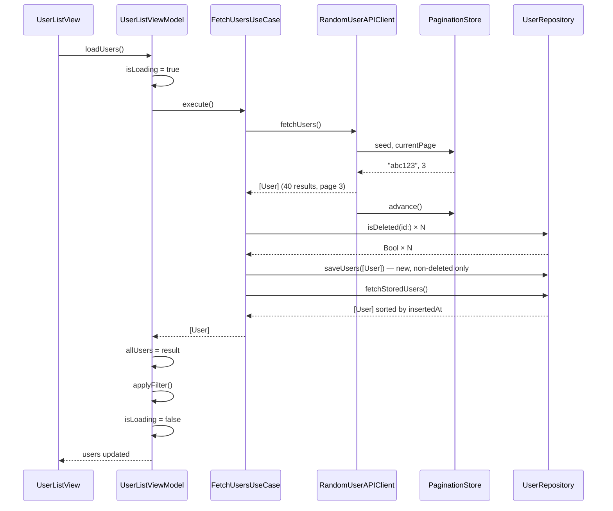
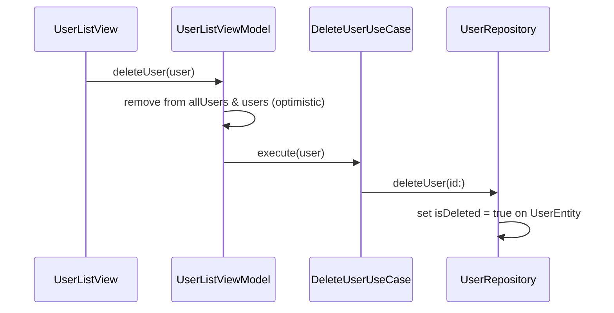
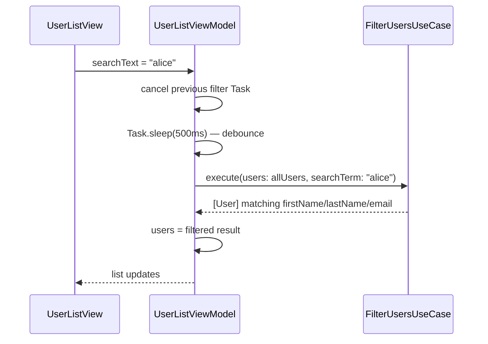
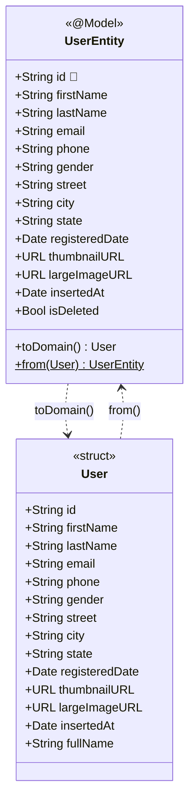

# Architecture

## Overview

The app follows **Clean Architecture** with an **MVVM** presentation layer. The core rule is that all source-code dependencies point inward — toward the Domain layer. The Domain layer has no knowledge of SwiftUI, SwiftData, or URLSession.

```
Presentation  ──uses──►  Domain  ◄──implements──  Data
```

This means use cases and domain models can be tested without any framework setup, and the concrete data implementations can be swapped out freely (as the UI test `StubAPIClient` demonstrates).

---

## Layers

### Domain

Pure Swift. No `import` of any Apple framework beyond Foundation. Contains:

- **`User`** — the canonical domain model, used everywhere except the Data layer's internal DTO and persistence types
- **`UserRepositoryProtocol`** — defines storage operations: fetch, save, delete, check deletion
- **`RandomUserAPIClientProtocol`** — defines a single `fetchUsers() async throws -> [User]` operation
- **`FetchUsersUseCase`** — orchestrates an API fetch, deduplication, and persistence
- **`DeleteUserUseCase`** — thin wrapper that delegates to the repository
- **`FilterUsersUseCase`** — pure client-side search with no side effects

### Data

Implements the Domain protocols. Splits into three sub-areas:

| Sub-area | Responsibility |
|---|---|
| `Data/` root | `UserDefaultsManager` — a generic `UserDefaults` read/write wrapper with no knowledge of domain concepts. Shared across any Data-layer type that needs persistence of primitive values. |
| `Remote/` | `RandomUserAPIClient` fetches from `api.randomuser.me` using `URLSession`. Decodable DTOs (`RandomUserAPI.swift`) map the JSON response to domain `User` values via `toDomain(insertedAt:)`. `PaginationStore` manages the active seed and page counter, persisting them via `UserDefaultsManager`. |
| `Local/` | `UserRepository` wraps a SwiftData `ModelContext`. `UserEntity` is the `@Model` class. All queries filter `isDeleted == false` and sort by `insertedAt`. |
| `Stub/` | `StubAPIClient` returns three hard-coded users. Injected during UI tests via the `--ui-testing` launch argument. |

### Presentation

SwiftUI views and `@Observable` ViewModels. Depends only on use cases from the Domain layer — it never imports SwiftData or calls networking code directly.

| Type | Role |
|---|---|
| `UserListViewModel` | Owns `allUsers` (unfiltered), `users` (filtered), `isLoading`, `errorMessage`. Drives infinite scroll, search, and delete. |
| `UserListView` | Renders the list, wires swipe-to-delete, infinite scroll trigger, and `.searchable`. |
| `UserDetailView` | Display-only. No ViewModel needed — it receives a fully populated `User` value from the list. |
| `UserRowView` | Row component: circular thumbnail, name, email, phone. |

### App

`AppDependencies` is a `@MainActor` class that constructs the full dependency graph at app startup. It reads the `--ui-testing` launch argument to decide which implementations to inject.

---

## Data Flow

### Fetch Users (infinite scroll trigger)



### Delete User



Note: The delete is applied optimistically in the ViewModel before the repository call completes. Because `UserRepository` operates synchronously on a `@MainActor`-confined `ModelContext`, there is no meaningful async gap — the optimistic update and persistence happen in the same synchronous block from the UI's perspective.

### Search / Filter



---

## Dependency Injection

All dependencies are constructed once in `AppDependencies` and passed via SwiftUI's initializer chain — no environment objects, no singletons beyond the DI container itself.

```
RandomUserCodingChallengeApp
  └── AppDependencies (constructs full graph)
        └── ContentView(dependencies:)
              └── UserListViewModel(fetchUseCase:deleteUseCase:filterUseCase:)
                    └── UserListView(viewModel:)
                          └── UserDetailView(user:)   ← value type, no injection needed
```

The `ModelContainer` is passed to SwiftUI via `.modelContainer(dependencies.modelContainer)` on the root `WindowGroup`. This is required so SwiftUI's `@Environment(\.modelContext)` works correctly within the view hierarchy, even though the app's own code accesses the context only through `UserRepository`.

---

## SwiftData Entity Model

The app has a single SwiftData entity. The diagram shows all stored fields, their types, the unique constraint, and how the entity maps to and from the domain `User` struct.



**Notes:**
- `id` carries `@Attribute(.unique)` — SwiftData enforces uniqueness at the store level, preventing duplicate inserts.
- `isDeleted` exists only on `UserEntity`. It is a persistence concern, not a domain concept, so it is deliberately absent from the `User` struct.
- `insertedAt` is set by `RandomUserAPIClient` at fetch time (`Date()`), not sourced from the API. It drives the sort order in all `UserRepository` queries. Because seed-based pagination ensures pages are non-overlapping, users within a batch arrive in a stable API-defined order and are assigned monotonically increasing timestamps.
- `street` is a denormalised string (`"\(number) \(name)"`) constructed in `UserDTO.toDomain()`. The street number and street name are separate fields in the API response but are not useful independently in this app.
- `registeredDate` is decoded from the API's ISO 8601 timestamp using a custom `JSONDecoder` with `.iso8601` + `.withFractionalSeconds` date decoding strategy.

---

## Key Protocols

```swift
protocol UserRepositoryProtocol {
    func fetchStoredUsers() throws -> [User]
    func saveUsers(_ users: [User]) throws
    func deleteUser(id: String) throws
    func isDeleted(id: String) throws -> Bool
}

protocol RandomUserAPIClientProtocol {
    func fetchUsers() async throws -> [User]
}
```

These two protocols are the seam that makes the entire test strategy possible. Three implementations exist:

| Protocol | Production | Unit tests | UI tests |
|---|---|---|---|
| `RandomUserAPIClientProtocol` | `RandomUserAPIClient` | `MockAPIClient` | `StubAPIClient` |
| `UserRepositoryProtocol` | `UserRepository` | `MockUserRepository` | `UserRepository` (in-memory `ModelContainer`) |
